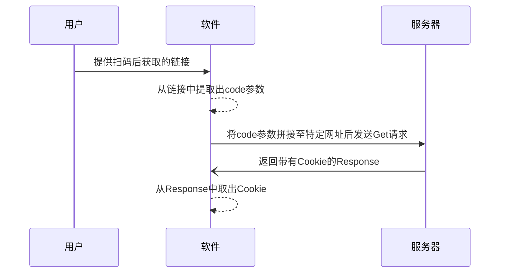
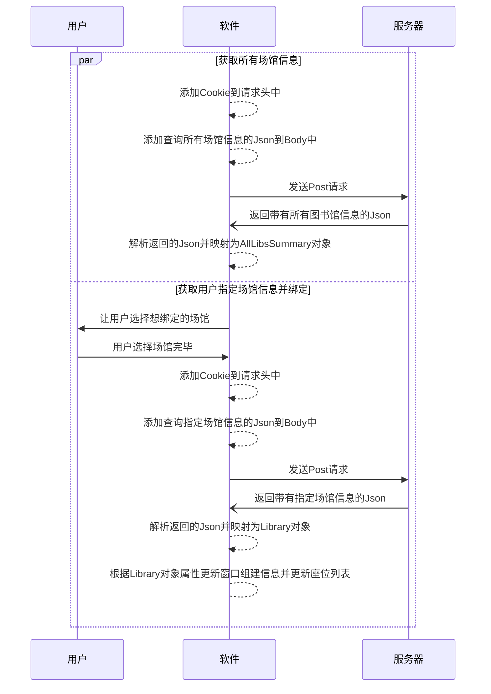
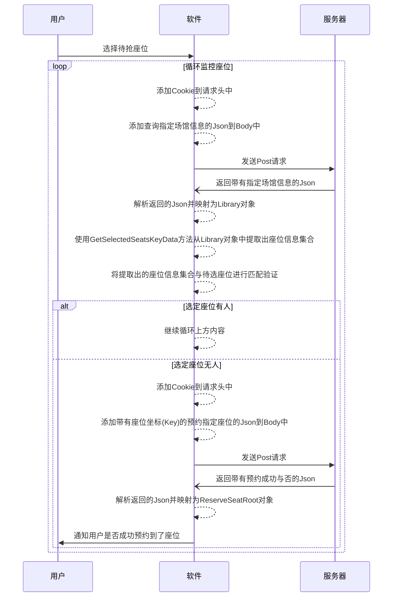
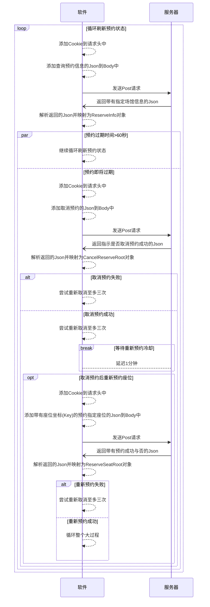

# 我去图书馆小助手 - IGoLibraryHelper

# 简介

**我去图书馆小助手**(以下简称"小助手")由**E剑终情**根据"我去图书馆"这一智慧图书馆座位管理系统而编写。可实现**空座实时监控、秒抢座和占座**等功能。采用最新的**.NET 6**编写，目前可运行在Windows7~11所有系统版本上，未来预期将在Linux和Mac上实现跨平台运行。**本软件永远免费、开源、持续更新。**

---

# 功能介绍

### 绑定图书馆

可自动获取账号绑定的学校的所有在"我去图书馆"系统下注册的场馆，后续将实现多场馆多线程监控(效果图可见上方的软件截图)

### 抢座

设置想要的座位后开启监控，每隔一段时间(可自由设置)会自动刷新并获取想要的座位状态，如果座位空出则预定该座位，否则将持续运行至抢到座位为止

### 占座

在已有预约的情况下在预约到期的前1分钟取消预约，然后等待1分钟的重新预约冷却过后再重新预约该座位。并循环此过程达到无需去签到、不会被举报即可占领该座位一整天

---

# 使用教程

### ⭐前置条件

> 注意：此前置条件仅针对压缩包后有"Portable-DependencyFramework"的版本，正常版本正常运行即可

由于软件采用最新的.NET 6编写来获取更新的语言特性和运行效率，部分系统上可能没有.NET 6运行时。在尝试运行软件时可能软件会报错，点击"是"即可跳转至下载链接，安装后即可运行软件。

或者移步：[下载 .NET 6.0 运行时](https://dotnet.microsoft.com/zh-cn/download/dotnet/6.0/runtime?utm_source=getdotnetcore&utm_medium=referral "点此跳转去下载") 进行下载。下载时选择“运行桌面应用 - 下载x64/86(根据系统选择)”

### 第一步：获取Cookie

1.使用已经在"我去图书馆"绑定好学校等信息的**微信**扫软件内的二维码

​​

2.点击页面右上角的"..."，然后点击复制链接

​​

3.将复制后的链接通过任意方式(QQ/微信等等等)发到电脑上然后复制粘贴到软件中，然后点击"获取并填写Cookie"按钮即可

​​

4.如果链接正确Cookie就会获取成功，右下角会弹出获取成功的提示并自动跳转到绑定图书馆的界面

​​

> 注：扫码后拿到的链接无论是否成功获取Cookie都只能用一次，如果还要用需要再次扫码

### 第二步：绑定图书馆

1.在Cookie正确填写后点击"绑定"按钮

​​

2.选择需要绑定的场馆(目前只能选择一个)

​​

3.选择完后点击确定即可完成绑定，右侧会显示绑定的场馆的信息

​​

### 第三步：抢座

1.绑定图书馆完成后切换到 "抢座 - 选择座位" 页面，并选择需要抢的座位，选择完成后点击"添加选中座位至抢座列表"

> 注意：选择座位是点击列表最左侧空白的那一列进行选择，按住Ctrl可以多选，最大选择数不设上限

​​

2.在"抢座 - 抢座控制台"打开操作开关，如实时数据正常显示则表示已经开始抢座了

​​

定时抢座的用法：点击定时抢座的时间框即可设定时间，设定好时间后再打开操作开关到设定时间即可自动抢座

> 如果不需要定时抢座只需要将时间设为00:00:00即可关闭定时功能

​​

### Extra：占座

> 使用此功能需要你已经预约好了座位！预约好了座位！预约好了座位！

1.点击按钮"刷新预约状态"直到右上角的预约座位信息处正确显示了你的预约信息

​​

2.打开占座的操作开关，如实时数据正常显示则表示已经开始占座了

​​

---

# 原理分析

### 获取Cookie

### 绑定图书馆

### 抢座

### 占座

---

# 更新日志

更新日志请参见[项目页面](https://xn--e-5g8az75bbi3a.com/%E9%A1%B9%E7%9B%AE%E5%8F%91%E5%B8%83/14.html)

---

# 作者有话说

此项目的开发初衷只是为了提升自己的编程技术、能力，丰富自己对协议方面的经验，所发布的软件也仅作学习之用，无其他任何用途

* 本人无意侵犯任何组织或个人的权益, 并非针对"我去图书馆"系统和其公司，**仅作学习交流**
* 本项目完全免费、开源，如果有BUG欢迎前往[Github](https://github.com/EJianZQ/IGoLibrary "前往GitHub")给我提Issue或者和我一起贡献源代码来维护更新此项目。如果喜欢此项目**请给我点一个小小的Star** :)
* 尽管此项目遵循MIT开源许可证，您可以随意修改源代码、版权并自主选择是否闭源，**但衷心建议不要二次修改此项目用来收费盈利，这会背离开源项目的初衷**
