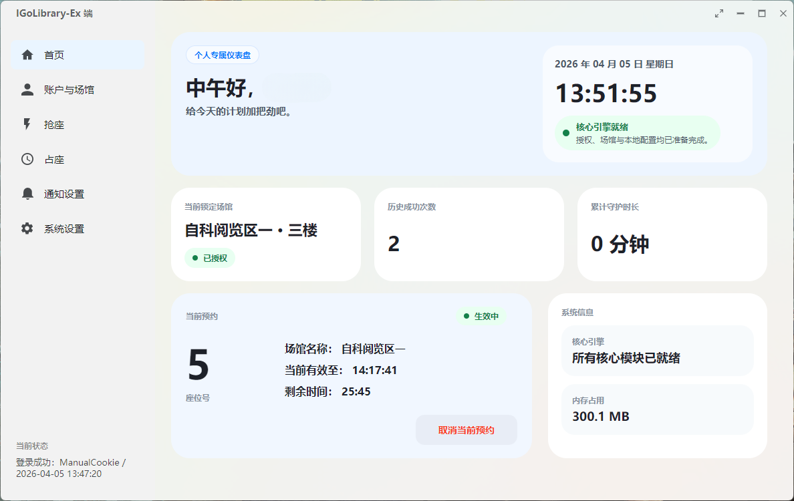

<p align="center">
  
</p>

<h1 align="center">我去图书馆助手 - IGoLibrary 📖</h1>

<p align="center">
  
  
  
  
  
  
</p>

<p align="center">
  IGoLibrary-Ex 是基于 <code>Avalonia</code> 重构的新一代跨平台桌面端实现。可运行在 <code>Windows 10 22H2</code> 及以上与 <code>macOS 15 Sequoia</code> 及以上。已实现 <strong>扫码获取 Cookie</strong>、<strong>座位实时监控并抢座</strong>、<strong>利用退座机制进行占座</strong> 和 <strong>Cookie 过期提醒</strong> 等实用功能
</p>

<p align="center">
  
</p>

## ✨ 核心功能

- 🔐 基于微信扫码链接来获取 Cookie 完成登录，并支持恢复本地保存的会话
- 🏛️ 自动加载账号下可用场馆，支持选择、预览并锁定当前作业场馆
- ⚡ 支持多目标座位监控，实现退座监控秒抢、定时抢座
- ♻️ 支持占座流程，在预约即将到期时自动取消并重新预约
- ⭐ 支持收藏常用座位，并为每个场馆分别持久化座位收藏
- 📊 首页面板展示当前场馆、预约状态、累计成功次数和守护时长
- 🔔 支持 Cookie 失效提醒，可通过右下角 Toast 弹窗、提示音和 SMTP 邮件通知用户
- 🧩 支持自定义 API 地址覆盖，便于在接口地址或 GraphQL 模板变化时快速调整

## 🧱 项目结构

```text
IGoLibrary-Ex/
  src/
    IGoLibrary.Ex.Domain/           领域模型
    IGoLibrary.Ex.Application/      用例编排、任务协调器、应用服务
    IGoLibrary.Ex.Infrastructure/   API、持久化、GraphQL模板、邮件通知
    IGoLibrary.Ex.Desktop/          Avalonia UI、ViewModel、桌面交互
  tests/
    IGoLibrary.Ex.Tests/            单元测试与界面逻辑测试
  build/                            发布脚本
```

## 🚀 使用说明
> [!TIP]
> 当前以 `IGoLibrary-Ex` 作为主项目说明，旧版 WinForm 项目的历史 README 已迁移至 [README_Winform.md](README_Winform.md)
> `IGoLibrary-Ex` 目前仍处于测试阶段，可能会有未知BUG。旧版 WinForm 项目仍正常稳定工作，如需使用旧版请移步 [Winform -1.3版本](https://github.com/EJianZQ/IGoLibrary/releases/tag/Public1.3) 进行下载

### 1️⃣ 获取 Cookie
1. 在 `账户与场馆` 页面使用已经在微信绑定好"我去图书馆"学校等信息的**微信**扫描软件内的二维码
2. 点击页面右上角的"..."，然后点击复制链接
3. 将复制后的链接通过任意方式(手机QQ/微信等等)发到**电脑上**然后
4. 在电脑上复制该链接，回到软件的 `账户与场馆` 页面，将会自动识别并填写好 Cookie

### 2️⃣ 锁定场馆
1. 在 `账户与场馆` 页面，如果 Cookie 正确获取了，会显示✅绿色对勾和**已授权**字样
2. 在页面右半边，点击 `更换当前场馆...` 按钮即可选择场馆
3. 选择好场馆后点击 `保存并锁定场馆` 按钮即可正式锁定该场馆

### 3️⃣ 抢座
1. 在 `抢座` 页面点击 `选择目标座位` 按钮，选择欲监控座位。座位以边框颜色区分是否已经被占，收藏座位会在该座位右上角添加⭐标
2. 选择 `抢座执行策略`，默认直接发送预约请求，不懂可直接默认。`抢座模式` 分为极限速度、随机延迟和延迟 5 秒，区别如下：
   - 极限速度：以最快速度抢，适合临时秒杀。例如 早上8点开始抢，`7:59:55` 的时候使用极限速度模式开始监控
   - 随机延迟：每次监控一轮后，随机延迟 N 秒进入下一轮，适合想要的座位已经被人占了，挂着软件监控该座位
   - 延迟 5 秒(默认)：每次监控一轮后，延迟 5 秒进入下一轮，最平衡的模式，推荐使用
3. 点击 `开始监控` 按钮，确认任务开始后把软件挂在后台即可。若监控的座位空出会立即预约并在右下角弹出 Toast 弹窗提醒

### 4️⃣ 占座
> [!TIP]
> 使用此功能，你必须要已经预约好了座位！
1. 在 `页面` 你会看到当前的预约信息，如果没有则点击 `手动刷新` 按钮
2. 设置 `重新预约间隔`。每个学校都不一样，需要你自己事先看一下。随便预约一个座位，然后取消。取消之后再立刻去预约座位，会提示**取消预约后 N 分钟不可再次预约**之类的文案，把 N 分钟折算成秒数填入软件
3. 点击 `开始占座` 按钮，确认任务开始后把软件挂在后台即可

### 5️⃣ 系统提醒
系统提醒目前包含 Cookie过期提醒、抢座成功提醒和抢座失败提醒
####  邮件提醒配置
参见（还未完成该文档）
#### 本地弹窗提醒
当监测到 Cookie 过期时，会在屏幕右下角弹出 Toast 弹窗提醒 Cookie 已过期。如果打开了提示音，还会有相应的提示音

## 🛠️ 开发与构建

### 环境要求

- 建议使用 `IGoLibrary-Ex/global.json` 指定的 `.NET SDK 10.0.201`
- Windows 开发环境可直接使用 Visual Studio 2022 或 `dotnet CLI`
- 仓库已提供 Windows 与 macOS 的发布脚本

### 本地运行

```powershell
cd .\IGoLibrary-Ex
dotnet restore
dotnet run --project .\src\IGoLibrary.Ex.Desktop\IGoLibrary.Ex.Desktop.csproj
```

### 运行测试

```powershell
cd .\IGoLibrary-Ex
dotnet test .\tests\IGoLibrary.Ex.Tests\IGoLibrary.Ex.Tests.csproj
```

### 发布示例

Windows

```powershell
cd .\IGoLibrary-Ex
.\build\publish-windows.ps1
```

macOS

```bash
cd ./IGoLibrary-Ex
./build/publish-macos.sh
```

## 💾 本地数据说明

应用会在本地使用 `SQLite` 保存配置、收藏座位、自定义API接口以及必要的会话信息

- Windows 默认数据目录：`%LOCALAPPDATA%\IGoLibrary-Ex`
- macOS 默认数据目录：`~/Library/Application Support/IGoLibrary-Ex`
- 可通过环境变量 `IGOLIBRARY_EX_DATA_DIR` 覆盖默认数据目录

## ⚠️ 免责声明

本项目以学习、研究与交流为目的，用于桌面应用架构、协议交互、任务调度与本地通知等方向的实践探索。

- 本项目与“我去图书馆”系统及其所属组织不存在从属或官方合作关系
- 请在遵守所在学校、场馆及相关平台规则的前提下了解和使用本项目
- 如果你发现问题，欢迎提交 Issue 或继续完善 `IGoLibrary-Ex`

## 📄 License

本项目基于 [MIT License](LICENSE.txt) 开源。
